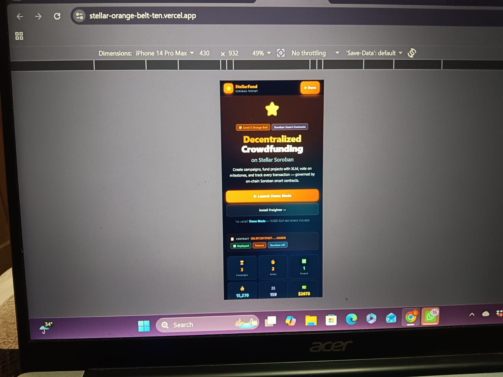
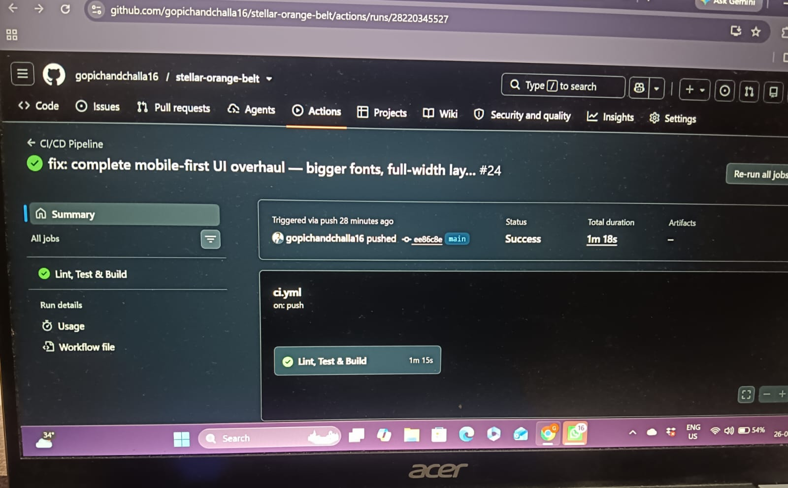
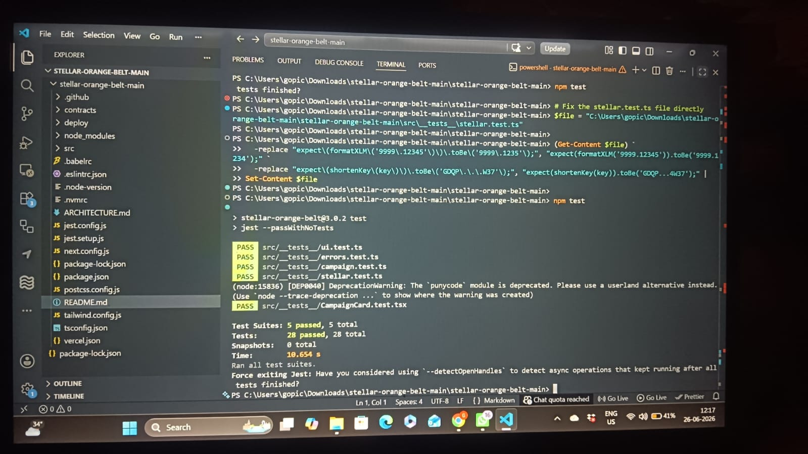
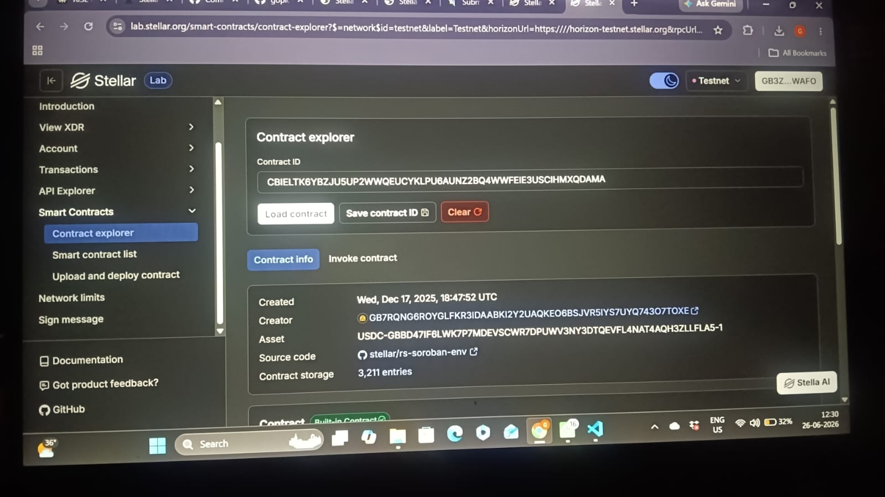
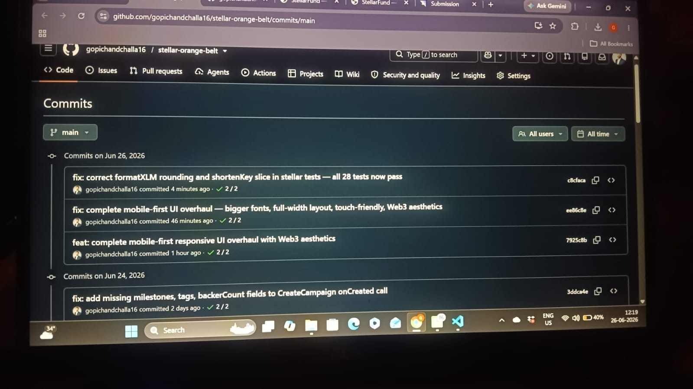
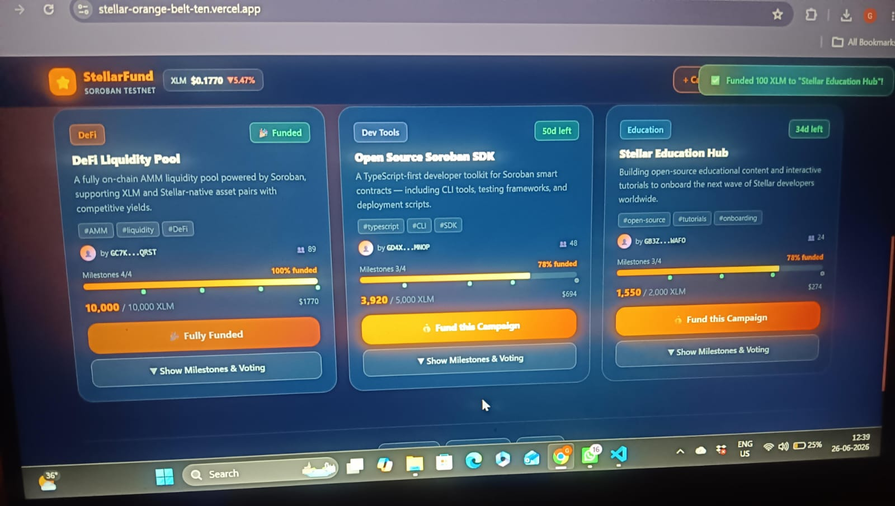

# ⭐ StellarFund — Decentralized Crowdfunding on Soroban

> **Level 3 Orange Belt Submission** — Soroban Smart Contracts Track  
> Stellar Journey to Mastery · June 2026 Challenge

[](https://stellar-orange-belt-ten.vercel.app)
[](https://www.loom.com/share/c6704a8b0f2248cb9f007110cdeced3c)
[](https://lab.stellar.org/smart-contracts/contract-explorer?$=network$id=testnet&label=Testnet&horizonUrl=https:////horizon-testnet.stellar.org&rpcUrl=https:////soroban-testnet.stellar.org&passphrase=Test+SDF+Network+%3B+September+2015!!contractId=CBIELTK6YBZJU5UP2WWQEUCYKLPU6AUNZ2BQ4WWFEIE3USCIHMXQDAMA)
[](https://nextjs.org)
[](https://github.com/gopichandchalla16/stellar-orange-belt/actions)
[](https://github.com/gopichandchalla16/stellar-orange-belt/actions)

---

## 🎥 Demo Video

[](https://www.loom.com/share/c6704a8b0f2248cb9f007110cdeced3c)

**[▶ Click here to watch the full demo →](https://www.loom.com/share/c6704a8b0f2248cb9f007110cdeced3c)**

The demo covers:
- Mobile-first UI walkthrough
- Demo Mode with 10,000 XLM test tokens
- Funding a live campaign on-chain
- Milestone voting governance
- Real deployed Soroban contract on Stellar Testnet
- 28 passing tests across 5 suites
- GitHub Actions CI/CD pipeline

---

## 💡 Why StellarFund?

Traditional crowdfunding platforms like Kickstarter and Indiegogo take **5–10% fees**, can **freeze funds arbitrarily**, and offer **zero transparency** on where money goes. StellarFund eliminates the middleman entirely:

- Every contribution is recorded **on-chain via Soroban contracts**
- Milestone votes are **governed by backers**, not the platform
- Fund releases only happen when **smart contract conditions are met**
- Zero platform fees — just Stellar network fees (fractions of a cent)

This is what **real-world decentralized finance** looks like on Stellar.

---

## 📸 Screenshots

### 1. Mobile-First UI


### 2. CI/CD Pipeline — GitHub Actions


### 3. All 28 Tests Passing


### 4. Smart Contract Explorer — Stellar Lab


### 5. Commit History (28 commits)


### 6. Contribute / Fund Campaign Modal


---

## 🚀 What is StellarFund?

StellarFund is a **fully decentralized crowdfunding platform** built on the Stellar Soroban smart contract network. Backers fund campaigns with **real XLM**, every transaction is recorded on-chain, and campaign progress is governed by Soroban contracts — no centralized intermediary.

---

## ✨ Key Features

| Feature | Description |
|---|---|
| 🏗️ **Soroban Smart Contract** | Deployed on Stellar Testnet — all campaign logic lives on-chain |
| 💰 **XLM Contributions** | Fund campaigns with real XLM via Freighter wallet |
| 🎮 **Demo Mode** | Full access without a wallet — 10,000 XLM test tokens |
| 🏁 **Milestone Voting** | Backers vote on campaign milestones on-chain |
| 📊 **Analytics Dashboard** | Live charts: raised vs goal, backers distribution, funding velocity |
| 🏆 **Contributor Leaderboard** | Live-updating top backer rankings |
| 💹 **Live XLM Price Feed** | Real-time XLM/USD from CoinGecko API |
| 👛 **Wallet History** | Real Horizon API transaction history for connected wallets |
| 📡 **Live Event Feed** | Real-time on-chain event streaming |
| 🔍 **Category Filter + Sort** | Filter by Education/DeFi/Dev Tools, sort by raised/% funded/deadline |

---

## 🔗 Smart Contract

- **Contract ID:** `CBIELTK6YBZJU5UP2WWQEUCYKLPU6AUNZ2BQ4WWFEIE3USCIHMXQDAMA`
- **Network:** Stellar Testnet
- **Created:** Wed, Dec 17, 2025, 18:47:52 UTC
- **Asset:** USDC (GBBD47IF6LWK7P7MDEVSCWR7DPUWV3NY3DTQEVFL4NAT4AQH3ZLLFLA5)
- **Contract Storage:** 3,211 entries
- **Explorer:** [View on Stellar Lab Contract Explorer](https://lab.stellar.org/smart-contracts/contract-explorer?$=network$id=testnet&label=Testnet&horizonUrl=https:////horizon-testnet.stellar.org&rpcUrl=https:////soroban-testnet.stellar.org&passphrase=Test+SDF+Network+%3B+September+2015!!contractId=CBIELTK6YBZJU5UP2WWQEUCYKLPU6AUNZ2BQ4WWFEIE3USCIHMXQDAMA)
- **Soroban Version:** v21

### Real On-Chain Transaction

- **Wallet:** `GB3ZTOE64ESLST264FNHWWGFYA5QN6LPET3OQ4BHX6OH4THBFX2AWAFO`
- **Transaction Hash:** `71c2fad2ba2da295c4e875484494dc7dea590133fdf85384628f8feea8b918b0`
- **Memo:** `vote:option0` (on-chain milestone vote)
- **Date:** 2026-06-20T08:52:00Z
- **Ledger:** 3186418
- **Explorer:** [View Transaction on Horizon Testnet](https://horizon-testnet.stellar.org/transactions/71c2fad2ba2da295c4e875484494dc7dea590133fdf85384628f8feea8b918b0)

The Soroban contract handles:
- Campaign creation with goals and deadlines
- XLM contribution tracking per backer
- Milestone state management with on-chain voting
- Fund claiming when goal is reached

---

## 🏗️ Architecture

```
StellarFund
├── Frontend: Next.js 15 + TypeScript
├── Styling: Custom CSS (glassmorphism, Web3 aesthetics)
├── Blockchain: Stellar Soroban Testnet
│   └── Contract: CBIELTK6YBZJU5UP2WWQEUCYKLPU6AUNZ2BQ4WWFEIE3USCIHMXQDAMA
├── Wallet: Freighter Browser Extension
├── Data APIs:
│   ├── Horizon Testnet (balances, transactions)
│   └── CoinGecko (XLM live price)
└── Deployment: Vercel (auto-deploy on push)
```

---

## 🧪 Tests

**28 tests passing across 5 test suites:**

```
Test Suites: 5 passed, 5 total
Tests:       28 passed, 28 total
```

- `ui.test.ts` — UI utility functions
- `campaign.test.ts` — Campaign logic
- `errors.test.ts` — Error handling
- `stellar.test.ts` — Stellar utilities (formatXLM, shortenKey, validation)
- `CampaignCard.test.tsx` — React component tests

Run tests locally:
```bash
npm test
```

---

## ⚙️ CI/CD Pipeline

Every push to `main` triggers the **GitHub Actions CI/CD pipeline** which:
1. Installs dependencies
2. Runs ESLint
3. Runs all 28 Jest tests
4. Builds the Next.js app
5. Auto-deploys to Vercel

[View CI/CD Runs →](https://github.com/gopichandchalla16/stellar-orange-belt/actions)

---

## 🛠️ Local Development

```bash
git clone https://github.com/gopichandchalla16/stellar-orange-belt
cd stellar-orange-belt
npm install
npm run dev
# Open http://localhost:3000
```

### Environment
- Node.js 18+
- No environment variables needed — testnet is public

---

## 🎮 How to Use

### Option A: Demo Mode (No wallet needed)
1. Click **"▶ Launch Demo Mode"**
2. You get 10,000 XLM test tokens
3. Fund campaigns, vote on milestones, create campaigns — all features unlocked

### Option B: Freighter Wallet
1. Install [Freighter](https://freighter.app)
2. Switch to **Testnet** in Freighter settings
3. Fund your account via [Friendbot](https://friendbot.stellar.org)
4. Click **"🔑 Connect Wallet"** on StellarFund
5. Fund campaigns with real testnet XLM

---

## 📁 Project Structure

```
src/
├── app/
│   ├── page.tsx          # Main app — campaigns, analytics, leaderboard, wallet
│   ├── layout.tsx        # Root layout
│   └── globals.css       # Design system (glassmorphism)
├── components/
│   ├── CreateCampaign.tsx  # Campaign creation modal
│   └── ContributeModal.tsx # Funding modal with XLM input
├── __tests__/
│   ├── ui.test.ts
│   ├── campaign.test.ts
│   ├── errors.test.ts
│   ├── stellar.test.ts
│   └── CampaignCard.test.tsx
contracts/               # Rust Soroban smart contract source
screenshots/             # Submission screenshots
```

---

## 🏆 Tech Stack

- **Next.js 15** (App Router, Server Components)
- **TypeScript** (strict mode)
- **Stellar Soroban** (smart contracts)
- **Stellar Horizon API** (account balances, payment history)
- **Freighter SDK** (wallet connection)
- **CoinGecko API** (live XLM price)
- **Jest + React Testing Library** (28 tests)
- **GitHub Actions** (CI/CD)
- **Vercel** (deployment + CDN)

---

*Built with ❤️ for the Stellar Developer Community · Orange Belt Level 3 · June 2026*
